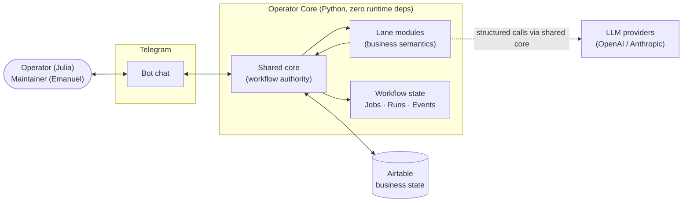
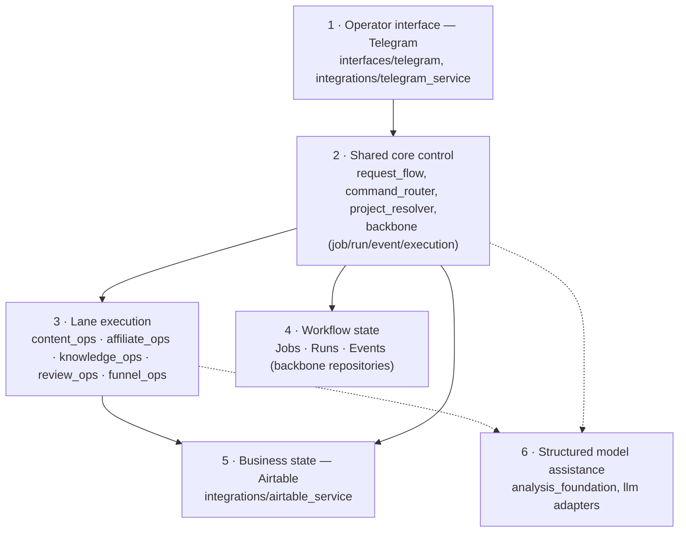
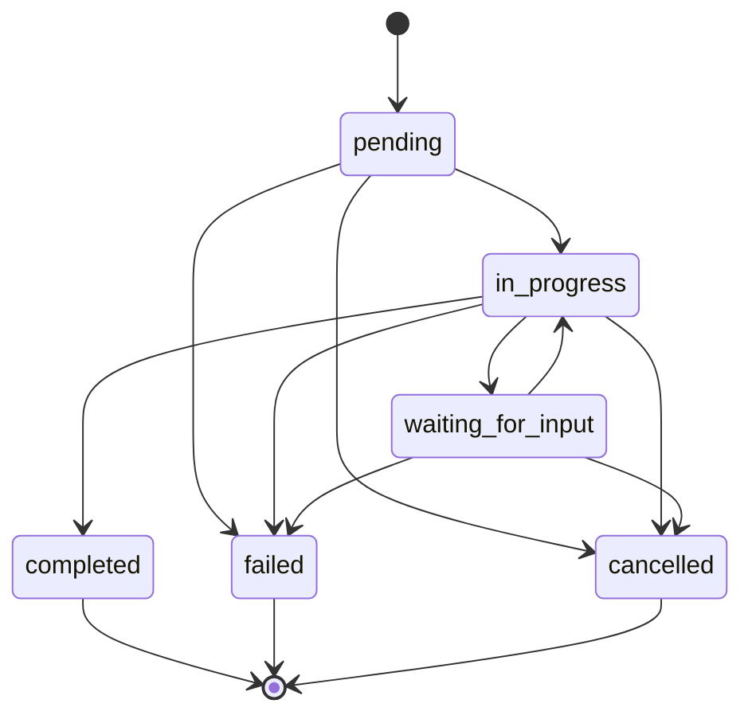
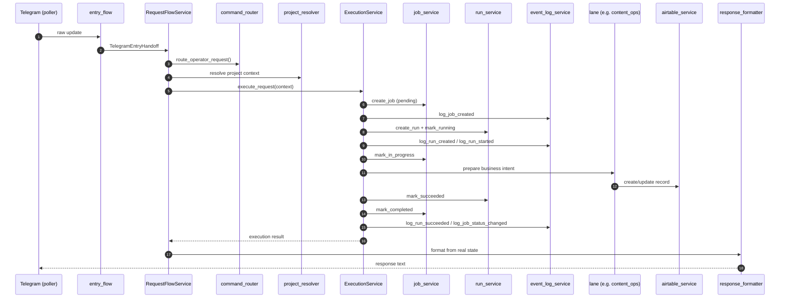
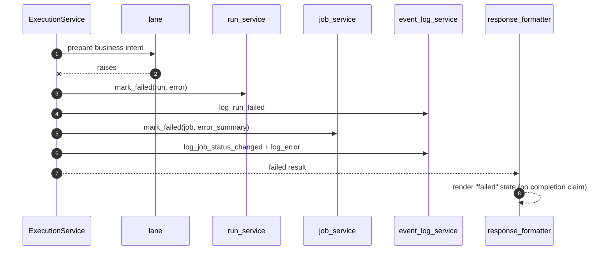
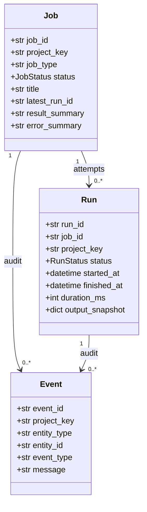

# Architecture Overview

> **Scope of this document.** This is the architectural truth for Operator Core: the layers,
> the workflow-state model, the shared-core vs lane boundaries, project-context ownership, and
> the single-writer ownership rules. Where the snapshot code does not yet implement a
> documented idea, this file says so explicitly (see [Status and roadmap](#status-and-roadmap)) —
> it never claims behaviour the code does not have.

## At a glance

- **What it is.** A human-in-the-loop *operator runtime*: a person drives project operations
  through Telegram; a Python shared core turns each message into an auditable unit of work and
  persists business state in Airtable. It is **not** a freeform chatbot.
- **Three core ideas.**
  1. **Workflow state is first-class.** Every action becomes a `Job`, each execution attempt a
     `Run`, and every audit-relevant change an `Event` — not just chat text.
  2. **Single-writer ownership.** Exactly one module owns each piece of state, so meaning
     cannot drift. `job_service` owns Job state, `run_service` owns Run state,
     `event_log_service` owns Events, the project resolver owns project context, and
     `airtable_service` is the only path to Airtable.
  3. **Shared core vs lanes.** A reusable shared core owns workflow control; per-domain *lane*
     modules own business semantics. Neither crosses into the other.
- **Zero runtime dependencies.** `pyproject.toml` declares `dependencies = []`; HTTP to
  Telegram/OpenAI/Anthropic/Airtable is done with the standard library. `pytest` is the only
  dev/test dependency.
- **Two roles.** **Operator (Julia)** uses it daily for low-friction work; **Maintainer
  (Emanuel)** inspects and controls the same system. They see different response depth, never
  different workflow laws.

## System context

The operator works only through Telegram. The shared core is the sole authority over what
becomes work and how it is persisted. Airtable holds business records; the workflow-state layer
(Jobs/Runs/Events) is kept distinct from it.

## Layered architecture

Operator Core is six connected layers. Each has a clear owner and a clear "must not".

| Layer | Owns | Must **not** |
|---|---|---|
| 1 · Operator interface | Telegram intake/output, reply metadata | own workflow or business state |
| 2 · Shared core control | classification, project context, Job/Run/Event transitions, persistence orchestration, response shaping | own project/business *semantics* |
| 3 · Lane execution | business-object meaning and field-level write intent in one domain | own Jobs/Runs/Events or workflow state |
| 4 · Workflow state | authoritative `Job`/`Run`/`Event` records | hold business semantics |
| 5 · Business state | Airtable persistence adapter | decide semantics or workflow rules |
| 6 · Model assistance | structured analysis/generation from explicit inputs | be the authority for any state |

## Workflow-state model

Workflow state is the spine of the architecture, not a logging afterthought.

- **`Job`** — a business-level unit of work: what was requested, for which project and lane,
  and its lifecycle status.
- **`Run`** — one execution attempt linked to a Job: when it started/finished, and whether it
  succeeded, failed, or was cancelled.
- **`Event`** — an append-only audit marker: what meaningful change happened to which entity.

### Job lifecycle

The implemented Job state machine (`core/backbone/statuses.py`) is deliberately small and its
transitions are enforced:

> **Honesty note.** There is intentionally **no** `waiting_for_approval` state and **no**
> `approval_state` field in this snapshot. A confirmation/approval subsystem is described in the
> [Status and roadmap](#status-and-roadmap) section as *planned*, not as current behaviour.

## State authority model

Two distinct classes of authoritative state, each with a single writer.

### Authoritative workflow fields
- `Job.status` (`JobStatus`) — owned by `job_service`.
- `Run.status` (`RunStatus`) and run timing (`started_at`/`finished_at`/`duration_ms`) — owned
  by `run_service`.
- The `Events` table — owned by `event_log_service`.

### Authoritative business semantic fields *(intent)*
- `content_stage` — owned by `content_ops`.
- `monetization_stage` — owned by `affiliate_ops` (content-related) and `funnel_ops` (pages).
- `review_outcome` — owned by `review_ops`.

> **Honesty note.** The *negative* rule holds in code today (no shared-core module writes these
> fields). The *positive* ownership is currently an architectural intent: lanes persist
> business records through dynamic field dictionaries rather than hard-coded semantic-field
> keys. See the alignment report in `docs/PUBLIC-READINESS-CHECKLIST.md`.

### Non-duplication rule
No pseudo-status fields, no response text that pretends to be stored state, no module writing
meaning outside its boundary. This is what prevents state drift.

## Project-context model

Project context is resolved **once** and then treated as authoritative for the request.

- `core/project_resolver.py` is the single owner: `resolve_active_project_context()` returns a
  frozen `ResolvedProjectContext(project_key, display_name, …)`.
- No other module assigns the project key (verified: zero external assignments).

> **Honesty note.** In this snapshot the resolver derives the project from runtime
> configuration (the single active project, `everydayengel`). The richer multi-source
> resolution described historically (reply-metadata vs explicit vs chat-level context, and
> cross-project conflict blocking) is **roadmap**, not current behaviour.

## Shared core vs lane boundary

The architecture only works if both sides stay inside their boundaries.

- **Shared core owns:** Telegram intake/output, command classification, project resolution,
  Job/Run/Event lifecycle, persistence orchestration, response shaping.
- **Lanes own:** business-object meaning and allowed field-level writes in exactly one domain.

If shared core starts owning business semantics, project meaning drifts and core reusability
declines. If lanes start owning workflow state, Jobs/Runs lose authority and auditability
breaks.

## Canonical execution flow

The real path for a normal executable request (no confirmation, matching the snapshot):

### Failure path

If the lane step raises, the attempt and the Job are closed honestly — the formatter reports
the real failure, never a fake success:

## Consolidated data model

Workflow records (`core/backbone/models.py`) and the business records they reference:

**Business records (Airtable, owned by lanes via `airtable_service`):** `Project State`,
`Content Ideas`, `Content Drafts`, `Affiliate Offers`, `Offer Mappings`, `Funnel Pages`,
`Reviews`, plus the analysis-foundation objects `AnalysisSnapshot`, `WriterBrief`,
`EvidencePack`, `ModelExecutionMeta`. Business state and workflow state are stored and owned
separately, by design.

## Worked end-to-end example

**Scenario.** The operator sends a content-idea command in Telegram for project
`everydayengel`.

1. **Intake.** `poller.py` receives the update; `entry_flow.normalize_telegram_update()` turns
   it into a `TelegramEntryRequest`, and `build_telegram_entry_handoff()` produces a
   `TelegramEntryHandoff` carrying chat/user/reply metadata and the resolved project context.
2. **Route.** `RequestFlowService.handle_telegram_entry_handoff()` calls
   `command_router.route_operator_request()`, which returns a `RoutedCommand` classifying this
   as a content-lane request.
3. **Resolve project.** `project_resolver` confirms `project_key = "everydayengel"`.
4. **Create the unit of work.** `ExecutionService.execute_request()` asks `job_service` to
   create a `Job` (`status = pending`), logs `job_created`, then asks `run_service` to create a
   `Run` and `mark_running` it (`Run.status = running`, `started_at` set), logging
   `run_created` / `run_started`. The Job moves to `in_progress`.
5. **Business work.** `ContentOpsService` interprets the idea and prepares a `Content Ideas`
   record; the write is performed **through** `airtable_service.create_record(...)` — the lane
   never touches the Airtable API directly.
6. **Close out.** `run_service.mark_succeeded` records the outcome and timing; `job_service`
   marks the Job `completed` with a `result_summary`; `event_log_service` appends
   `run_succeeded` and `job_status_changed`.
7. **Respond.** `response_formatter` renders a concise, state-derived message
   (`✅ Anfrage verarbeitet … Bereich: content_ops …`) and Telegram delivers it.

The resulting audit trail — one `Job`, one or more `Runs`, and a chain of `Events` — is the
inspectable record of exactly what happened. If step 5 had raised, the [failure
path](#failure-path) would have produced a `failed` Job and an honest error response instead.

## Design decisions & trade-offs

Every major choice has a cost; naming the cost is the point.

| Decision | Why | Cost / trade-off |
|---|---|---|
| **Jobs/Runs/Events as first-class state** (not chat history) | Auditable, resumable, inspectable; responses derive from real state | More moving parts and write amplification per request than a stateless bot |
| **Single-writer ownership per field/table** | Prevents state drift; one place to reason about each transition | Indirection — callers must route through the owning service instead of writing directly |
| **Shared core vs lane split** | Reusable core across future projects; business meaning stays in lanes | Boundary discipline costs ceremony (intent prepared in lane, orchestrated by core) |
| **Workflow state kept separate from Airtable** | Business state and control trail evolve independently | Two stores to reason about; cross-references instead of one table |
| **Zero runtime dependencies** (stdlib HTTP) | Trivial to audit, install, and run; no supply-chain surface | Hand-rolled transport/JSON handling instead of mature client libraries |
| **Repository abstraction for backbone** (in-memory default) | Tests run with no external services; backbone is storage-agnostic | The persistent backbone binding is not part of this snapshot |
| **Confirmation modelled in docs before code** | Captures the intended safety design up front | Risk of doc/code drift — mitigated here by an explicit *not-implemented* status |

## Responsibility matrix

`W` = authoritative writer · `r` = reads/consumes · `via` = goes through the owner.

| Module | Job state | Run state | Events | Project key | Airtable | Business semantics |
|---|:--:|:--:|:--:|:--:|:--:|:--:|
| `request_flow` | r | r | r | r | – | – |
| `command_router` | – | – | – | r | – | – |
| `project_resolver` | – | – | – | **W** | – | – |
| `execution_service` | via | via | via | r | – | – |
| `job_service` | **W** | – | – | r | – | – |
| `run_service` | – | **W** | – | r | – | – |
| `event_log_service` | – | – | **W** | r | – | – |
| `airtable_service` | – | – | – | r | **W** | – |
| lanes (`*_ops`) | – | – | via | r | via | **W** |
| `response_formatter` | r | r | r | r | – | – |

## Where this lives in the code

Repo-relative deep links (paths are relative to this `docs/` file). Treat code as the source of
truth; documented names that differ from the code are reconciled here.

| Module (role) | Path | Responsibility (one line) |
|---|---|---|
| Telegram intake/output | [`../src/operator_core/interfaces/telegram/entry_flow.py`](../src/operator_core/interfaces/telegram/entry_flow.py), [`poller.py`](../src/operator_core/interfaces/telegram/poller.py), [`../src/operator_core/integrations/telegram_service.py`](../src/operator_core/integrations/telegram_service.py) | transport intake/output (doc name: `telegram_gateway`) |
| `command_router` | [`../src/operator_core/core/command_router.py`](../src/operator_core/core/command_router.py) | classification & routing (`route_operator_request`) |
| `request_flow` | [`../src/operator_core/core/request_flow/service.py`](../src/operator_core/core/request_flow/service.py) | orchestrates a Telegram handoff into execution |
| `project_resolver` | [`../src/operator_core/core/project_resolver.py`](../src/operator_core/core/project_resolver.py) | authoritative project context |
| `execution_service` | [`../src/operator_core/core/backbone/execution_service.py`](../src/operator_core/core/backbone/execution_service.py) | orchestrates Job/Run/Event lifecycle |
| `job_service` | [`../src/operator_core/core/backbone/job_service.py`](../src/operator_core/core/backbone/job_service.py) | Job lifecycle & `Job.status` |
| `run_service` | [`../src/operator_core/core/backbone/run_service.py`](../src/operator_core/core/backbone/run_service.py) | execution attempts & `Run.status`/timing |
| `event_log_service` | [`../src/operator_core/core/backbone/event_log_service.py`](../src/operator_core/core/backbone/event_log_service.py) | append-only `Events` |
| `airtable_service` | [`../src/operator_core/integrations/airtable_service.py`](../src/operator_core/integrations/airtable_service.py) | Airtable persistence adapter |
| llm adapters | [`../src/operator_core/integrations/anthropic_service.py`](../src/operator_core/integrations/anthropic_service.py), [`openai_service.py`](../src/operator_core/integrations/openai_service.py) | structured model calls (doc name: `llm_service`) |
| `response_formatter` | [`../src/operator_core/core/response_formatter/service.py`](../src/operator_core/core/response_formatter/service.py) | state-derived responses |
| `analysis_foundation` | [`../src/operator_core/core/analysis_foundation/service.py`](../src/operator_core/core/analysis_foundation/service.py) | AnalysisSnapshot/WriterBrief/EvidencePack |
| lane `content_ops` | [`../src/operator_core/core/content_ops/service.py`](../src/operator_core/core/content_ops/service.py) | content ideas & drafts |
| lane `affiliate_ops` | [`../src/operator_core/core/affiliate_ops/service.py`](../src/operator_core/core/affiliate_ops/service.py) | offers & monetization mapping |
| lane `knowledge_ops` | [`../src/operator_core/core/knowledge_ops/service.py`](../src/operator_core/core/knowledge_ops/service.py) | durable project truth (doc name: `knowledge_state_ops`) |
| lane `review_ops` | [`../src/operator_core/core/review_ops/service.py`](../src/operator_core/core/review_ops/service.py) | review outcomes (doc name: `review_analytics_ops`) |
| lane `funnel_ops` | [`../src/operator_core/core/funnel_ops/service.py`](../src/operator_core/core/funnel_ops/service.py) | funnel/page planning (doc name: `funnel_website_ops`) |

**Tests that pin these contracts:**
[routing](../tests/core/test_command_router.py) ·
[job lifecycle](../tests/core/backbone/test_job_service.py) ·
[run lifecycle](../tests/core/backbone/test_run_service.py) ·
[events](../tests/core/backbone/test_event_log_service.py) ·
[execution orchestration](../tests/core/backbone/test_execution_service.py) ·
[request flow](../tests/core/request_flow/test_service.py) ·
[formatting](../tests/core/response_formatter/test_response_formatter_service.py) ·
[proactive layer](../tests/proactive/test_checker.py)

## Status and roadmap

Honest separation of what the snapshot implements from what the docs describe as intent.

**Implemented and verified in code**
- Jobs / Runs / Events as a first-class, enforced state machine.
- Single-writer ownership for Job state, Run state, Events, the project key, and the Airtable
  write boundary.
- Shared-core vs lane isolation (lanes never touch workflow state).
- Telegram intake → routing → execution → state-derived response.
- A zero-runtime-dependency core with a broad, green test suite.

**Documented as architecture, not implemented in this snapshot** *(planned)*
- **Confirmation / approval subsystem:** `waiting_for_approval`, `approval_state`, `/confirm`,
  `/reject`, and a `rules_engine` policy layer. No code path exists yet.
- **Continuation & parent links:** `continuation_of_job_id` / `parent_job_id` are not on the
  `Job` model yet.
- **Multi-source project resolution:** reply-metadata vs explicit vs chat-level context and
  cross-project conflict blocking; today resolution is from runtime configuration.
- **Literal semantic-field ownership:** `content_stage` / `monetization_stage` /
  `review_outcome` as owned, hard-coded fields (currently written via dynamic field dicts).

See `docs/PUBLIC-READINESS-CHECKLIST.md` for the full Code–Doc Alignment report behind this
section.
